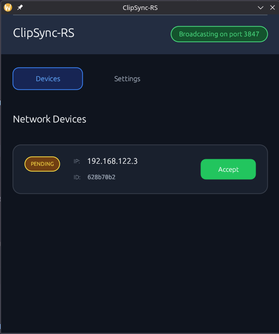
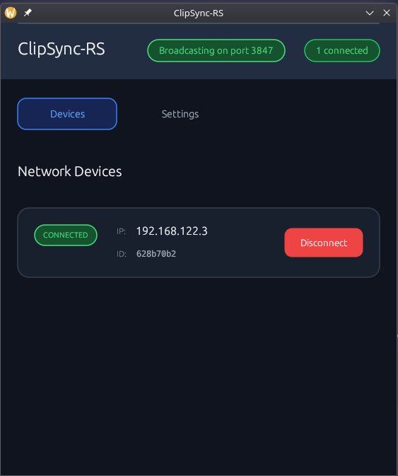

# ClipSync-RS

A lightweight cross-platform clipboard synchronization tool built in Rust. Built (vibe coded) it to sync clipboard between my Arch Linux and Windows VM. I hope it comes in handy for someone else too :3

> For us Linux users: It works both on `X11` and `Wayland` (u might need to install `wl-clipboard`).


## Overview

ClipSync-RS is a peer-to-peer clipboard synchronization application that allows seamless clipboard sharing between devices on the same network. With an elegant GUI and efficient network discovery, you can easily maintain a synchronized clipboard across multiple computers without relying on cloud services or third-party servers.

## Features

- **Peer-to-Peer Architecture**: Direct device-to-device communication
- **Automatic Network Discovery**: Find devices without configuration
- **Real-time Clipboard Sync**: Continuous sync in both ways
- **Cross-Platform**: `Windows`, `macOS`, and `Linux` compatible
- **Lightweight**: It's written in `Rust`
- **Local Network Only**: Works offline, no internet needed

## Installation

### Pre-built Binaries

Download the latest release for your platform from the [Releases](https://github.com/uwuclxdy/clipsync-rs/releases) page.

### Build from Source

1. Make sure you have Rust installed ([rustup](https://rustup.rs/) recommended)
2. Clone the repository:
   ```
   git clone https://github.com/uwuclxdy/clipsync-rs.git
   cd clipsync-rs
   ```
3. Build the application:
   ```
   cargo build --release
   ```
4. The executable will be available at `target/release/clipsync-rs`

## Usage

1. Launch ClipSync-RS on each device you want to synchronize
2. Navigate to the Devices tab
3. Connect to other devices on your network
4. Once connected, any content copied on one device will be automatically synced to paired devices

## Screenshots




## How It Works

ClipSync-RS uses a combination of UDP broadcasts for device discovery and TCP connections for reliable clipboard data transfer. When you copy text on one device, it's securely transmitted to all paired devices where it's automatically placed in their clipboard.

The application includes:
- Network discovery service for finding devices on the local network
- Clipboard monitoring and management
- Secure device pairing protocol
- Duplicate detection to prevent clipboard loops

## Development

This project uses:
- [egui](https://github.com/emilk/egui) and [eframe](https://github.com/emilk/eframe) for the GUI
- [tokio](https://github.com/tokio-rs/tokio) for asynchronous networking
- [arboard](https://github.com/1Password/arboard) for cross-platform clipboard access

## Contributing

Contributions are welcome! Please feel free to submit a Pull Request.

1. Fork the repository
2. Create your feature branch (`git checkout -b feature/amazing-feature`)
3. Commit your changes (`git commit -m 'Add some amazing feature'`)
4. Push to the branch (`git push origin feature/amazing-feature`)
5. Open a Pull Request

## License

This project is licensed under the MIT License—see the LICENSE file for details.
